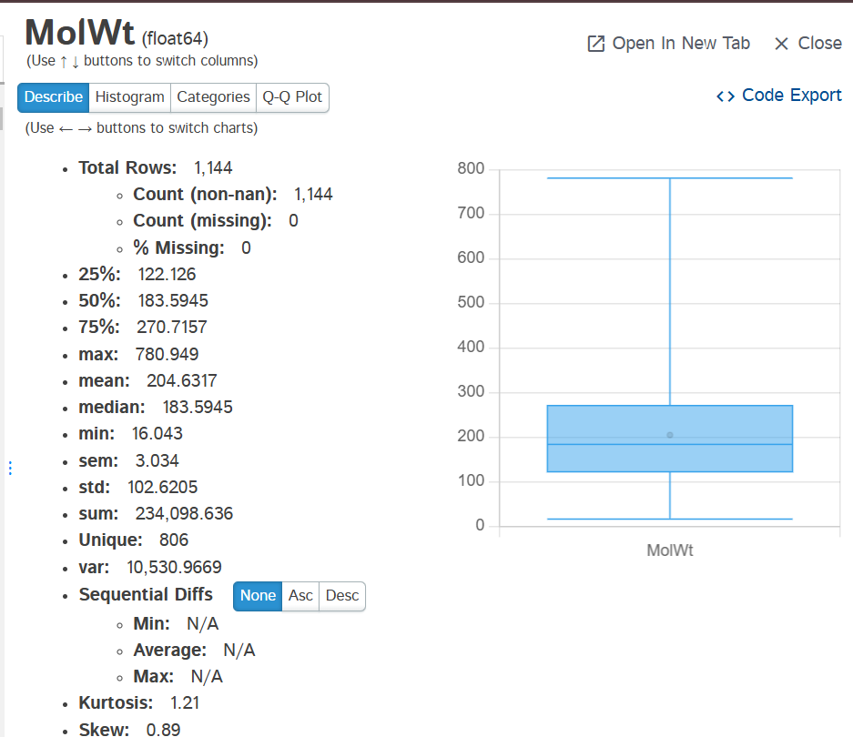
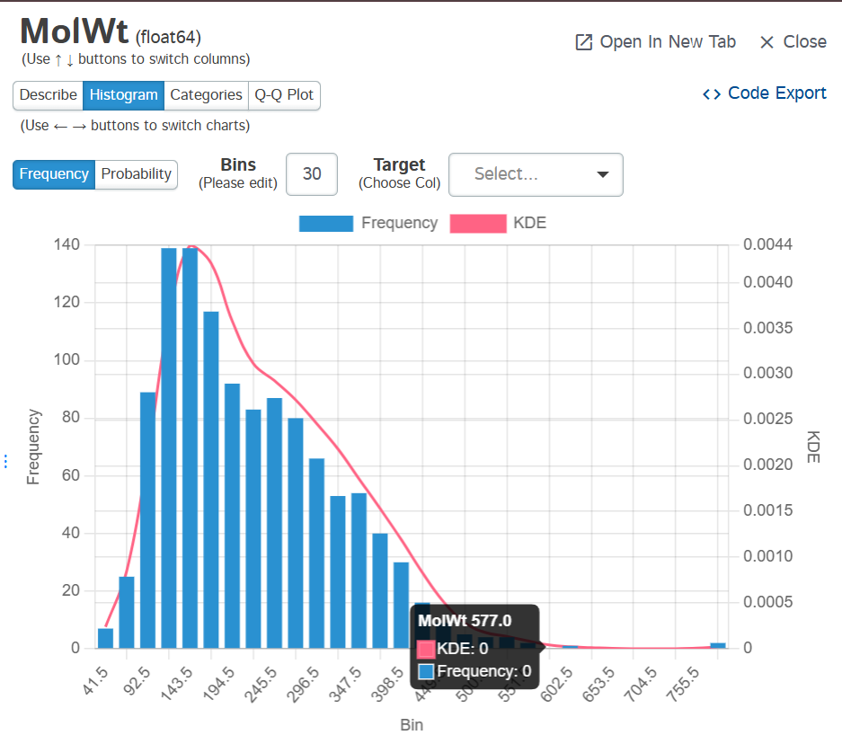
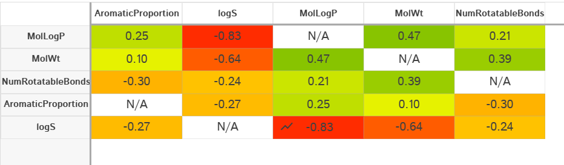
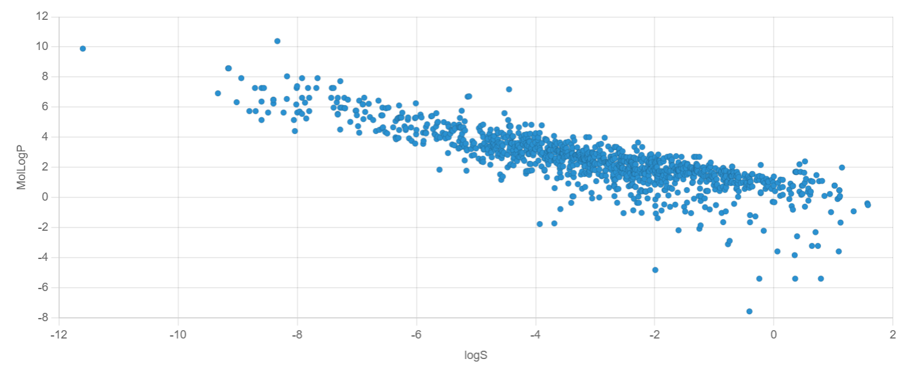
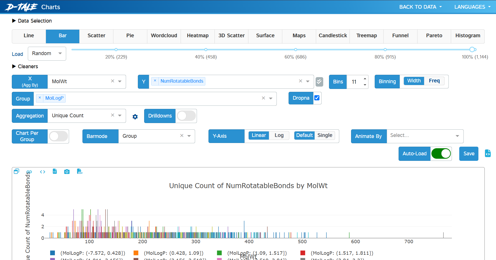
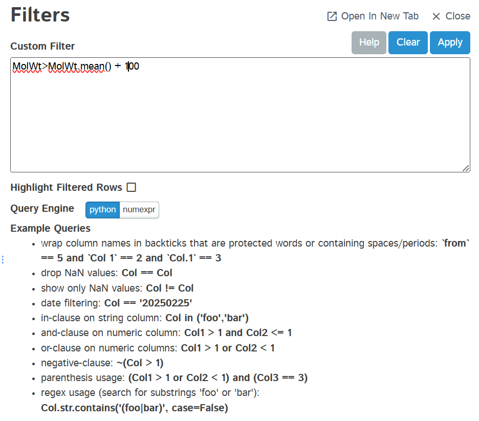
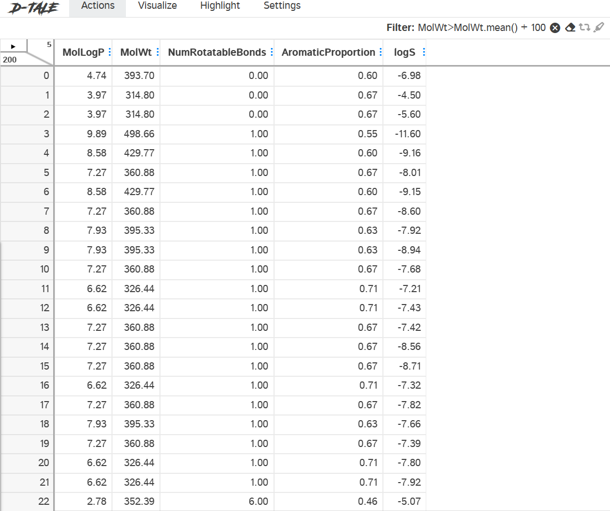
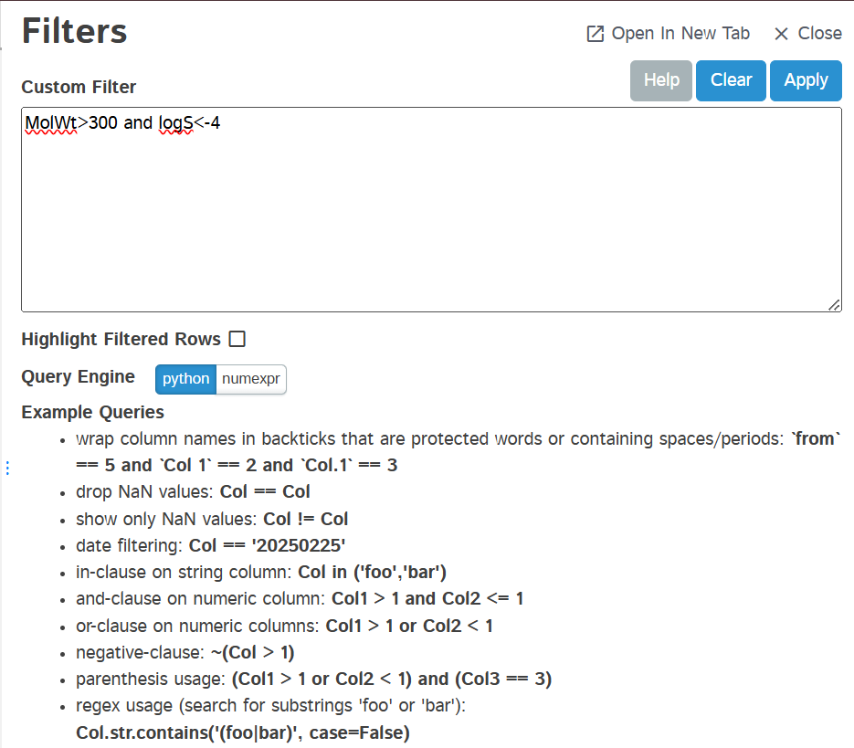
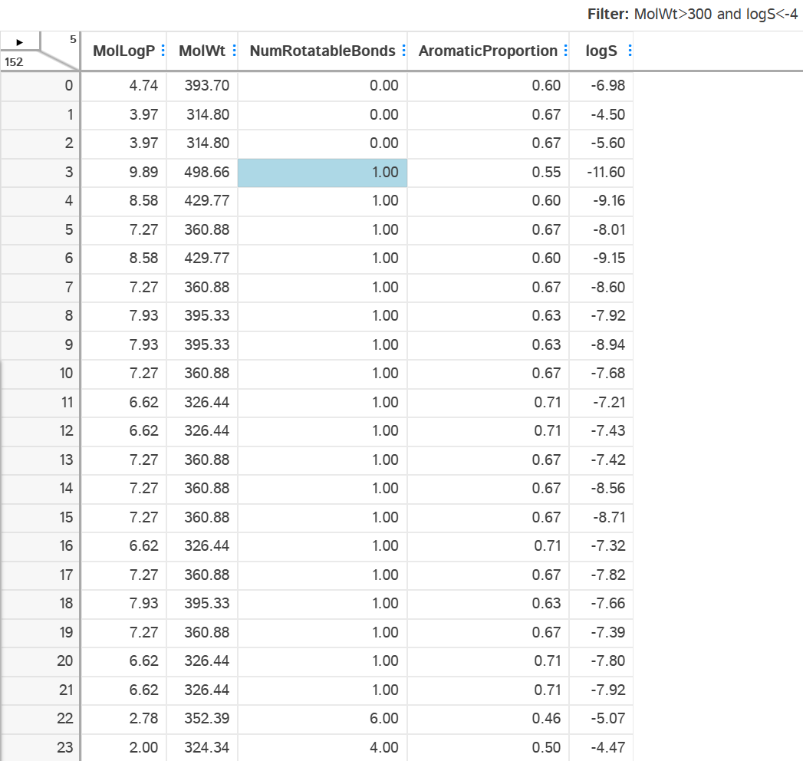

# D-Tale
**ES114-Probability Statistics and Data Visualization**
D-tale python library expository blog exploring D-Tale: An Interactive Tool for Data Analysis in Python

In the world of data analysis, Python provides a vast array of libraries that help users explore and visualize datasets efficiently. One such powerful yet often overlooked tool is D-Tale. This open-source Python library bridges the gap between raw data and insightful visual analysis by providing an interactive, web-based interface for Pandas DataFrames.

# Introduction

### What is D-Tale?

D-Tale is a Python extensiont that facilitates interaction with data sets and integrates with other Pandas functions. Users can browse, filter, visualize, and manipulate datasets with ease through a browser interface. D-Tale is useful for an analyst or a developer that prefers a graphical user interface (GUI) to do exploratory data analysis (EDA).

Users can with ease gain insights into their datasets with virtually zero extensive programming knowledge. Repetitive coding is eliminated with an intuitive GUI Users can generate statistics, visualize distributions, and set tens of other functionalities with simple interactions. Time spent on exploratory tasks is greatly reduced enabling greater productivity.

Furthermore, D-Tale is very customizable, supports table manipulations, and enables users to edit data on the go. It offers integration with a variety of data sources which makes it easier to analyze datasets from databases, CSV files, APIs, etc. It is a valuable tool for novice and advanced users seeking to boost productivity during data analysis work.

### What's next?
In this blog, we will explore everything D-Tale offers—from its key features and installation process to its practical applications in data analysis. We will also discuss  exploratory data analysis (EDA) through interactive visualizations, real-time data manipulation, and seamless integration with Pandas. Lets dive in.

# Installation & Setup
Before using DTale, install it along with necessary libraries. Run the following command in your Jupyter Notebook cell or Terminal :

```
$ pip install pandas
$ pip install dtale
``` 

Once installed, it can be used in a Jupyter Notebook or a Python script:
```python
import pandas as pd
import dtale

df = pd.read_csv("dataset.csv")  # Load your dataset
d = dtale.show(df)  # Launch D-Tale
d.open_browser()  # Open in web browser
 ``` 

This command will start a local web server and open a browser tab where users can interact with the dataset in real time.


Multiple sample csv file has been provided for demonstration. Running the code snippet above for dataset1, the following browser tab appears-


# Key Features of D-Tale

- **Automatic Data Summary**

  D-Tale offers users the data in a tabular format along with a summary of the dataset, including column types, missing values, and descriptive statistics.
- **Data Filtering & Sorting**

  Users can filter and sort datasets dynamically, making it easy to isolate specific records for deeper analysis.
- **Data Visualization**

  The library supports multiple chart types, including histograms, bar charts, scatter plots, and box plots, which can be generated directly from the interface.
- **Column Analysis**

  Each column in a dataset can be analyzed independently, displaying value distributions, correlations, and even automated insights.
- **Data Editing & Exporting**

   Users can modify datasets within the interface and export the updated data back to CSV, Excel, or JSON formats.
- **SQL Integration**

  D-Tale provides a built-in SQL editor, allowing users to write and execute queries on their data.

# Describe column
In D-Tale, the Describe function provides a summary of statistical properties for a selected column, similar to df.describe() in Pandas but column specific and with an interactive GUI. You can get the tab by left clicking the Target column

<p align="center">
  
  
</p>

It describes the column in turns of mean, meadian, min and max values and much more.

# Correlation

In D-Tale, the correlation function helps users analyze relationships between numerical variables in a dataset. It visually and statistically represents how different columns are related to one another. It uses the Pearson’s Correlation method to calculate the correlation coefficients

The Pearson correlation coefficient (\(r\)) is calculated as:

%20(Y_i%20-%20%5Cbar%7BY%7D)%7D%7B%5Csqrt%7B%5Csum%20(X_i%20-%20%5Cbar%7BX%7D)%5E2%7D%20%5Ctimes%20%5Csqrt%7B%5Csum%20(Y_i%20-%20%5Cbar%7BY%7D)%5E2%7D%7D)

Pearson’s Correlation Coefficient (r) measures the linear relationship between two numerical variables. It quantifies how strongly and in what direction (positive or negative) two variables are related.

You can display the correlation matrix by selecting it from the drop down. Or by using the .corr command.
```python
d.corr()
```
This function displays a heatmap matrix where each cell represents the correlation coefficient between two variables(columns).



The following correlations are shown for dataset2

Interpreting the Results
- **Values close to +1:**    Strong positive correlation 
- **Values close to -1:**    Strong negative correlation 
- **Values around 0:**       No significant correlation.

Selecting any cell also gives a scatter plot for the all values of the corresponding x and y variables



# Data Visualisation
Data visualization is essential in understanding patterns, trends, and insights within a dataset. D-Tale offers various charting options, allowing users to generate, customize, and export visualizations effortlessly. You can select variables to generate custom charts dynamically. D-Tale supports a variety of interactive charts.




## Major Attributes of D-Tale for Data Visualization

| Attribute          | Functionality |
|--------------------|--------------|
| **Charts**        | Offers multiple chart types, including Line, Bar, Scatter, Pie, Heatmap, etc. |
| **Binning**       | Controls data binning for histograms and bar charts, can be adjusted using Width or Frequency. |
| **Grouping**      | Enables grouping of data based on selected categorical or numerical variables. |
| **Correlation Heatmap** | Displays the correlation between numerical variables using a color-coded matrix. |
| **Histogram**     | Shows the distribution of a single variable, with KDE (Kernel Density Estimation) support. |
| **Scatter Plot**  | Visualizes relationships between two numerical variables. |
| **Box Plot**      | Displays distribution characteristics like median, quartiles, and outliers. |
| **Pareto Chart**  | Highlights the most significant factors in categorical data using a combined bar & line graph. |
| **Word Cloud**    | Generates a visual representation of text data, where word size represents frequency. |
| **Treemap**       | Displays hierarchical data using nested rectangles. |
| **Animate Charts** | Enables dynamic visual updates based on a selected variable. |
| **Export Options** | Allows exporting visualizations as PNG, CSV, or JSON files. |

# Custom  Filtering
D-Tale provides custom filtering options that allow users to dynamically refine datasets based on specific conditions without writing complex Pandas queries. This feature is useful for isolating relevant data points, identifying trends, and cleaning datasets interactively.
However Custom filters are vulnerable to code injection attacks, and should only be used in trusted environments.

```python
import pandas as pd
import dtale

df = pd.read_csv("dataset2.txt")  # Load your dataset
d = dtale.show(df,enable_custom_filters=True)  # Launch D-Tale with custom filters enabled
d.open_browser()  # Open in web browser
df
 ``` 
After launching D-Tale, click on the "Filter" button in the top menu. A filtering window appears, where you can apply custom conditions to any column. Choose the column you want to filter. Enter the value or condition for filtering.

<p align="center">
  
  
</p>

D-Tale allows users to combine multiple conditions using and/or (lowercase) operators for advanced filtering.

<p align="center">
  
  
</p>

Once filtered, you can export the refined dataset in CSV, TSV, Parquet or HTML format.


# Conclusion
In this blog, we explored D-Tale Python library, a powerful tool for automated exploratory data analysis (EDA).

### Key Takeaways
- **Interactive Data Exploration** –   D-Tale provides a **web-based GUI** for seamless data analysis, eliminating the need for repetitive coding.  
- **Rich Visualization Options** –   Offers various chart types, including **histograms, scatter plots, heatmaps, and bar charts** to uncover patterns and trends.  
- **Seamless Integration with Pandas** –   Works directly with **Pandas DataFrames**, making it easy to load, manipulate, and analyze datasets.  
- **Real-Time Data Manipulation** –   Allows **filtering, sorting, editing, and exporting** data on the fly, improving efficiency.  
- **Correlation & Insights** –   Supports **correlation heatmaps** and **statistical summaries** to identify relationships between features.  
- **No-Code Analysis** –   Suitable for both **technical and non-technical users**, reducing the learning curve for data visualization.  
- **Export & Reporting Capabilities** –   Enables saving **charts and tables** in various formats, making it ideal for reporting and presentations.  

### Why Use D-Tale?
- **Saves Time:** Instead of manually writing summary code, get an instant EDA report.
- **Better Understanding:** Quickly assess data quality before building models.
- **Useful for Any Dataset:** Whether working on ML, data science, or analytics, this tool speeds up workflows.

D-Tale is an essential tool for anyone handling structured datasets. It streamlines exploratory data analysis (EDA), making the process quicker, simpler, and more insightful!

# References & Further Reading
For more details, official documentation, and additional learning resources, check out these links:

Official D-Tale Docs: 
- GitHub Repository: [https://dtale.readthedocs.io/en/latest/](https://dtale.readthedocs.io/en/latest/)
- YouTube Tutorials on D-Tale: [https://www.youtube.com/watch?v=jYlwwNycVh8](https://www.youtube.com/watch?v=jYlwwNycVh8)
- PyPI Package (Installation Guide): [https://pypi.org/project/dtale/](https://pypi.org/project/dtale/)
- Pandas Profiling (Older Version): [https://pandas-profiling.ydata.ai/docs/master/](https://pandas-profiling.ydata.ai/docs/master/)


