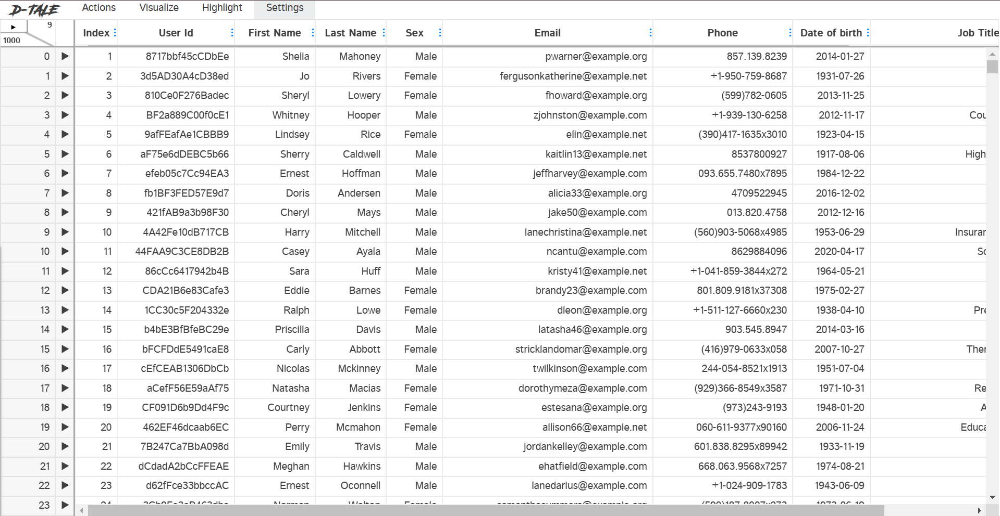

# D-Tale
ES114-Probability Statistics and Data Visualization; D-tale python library expository blog
Exploring D-Tale: An Interactive Tool for Data Analysis in Python

In the world of data analysis, Python provides a vast array of libraries that help users explore and visualize datasets efficiently. One such powerful yet often overlooked tool is D-Tale. This open-source Python library bridges the gap between raw data and insightful visual analysis by providing an interactive, web-based interface for Pandas DataFrames.

# Introduction

### What is D-Tale?

D-Tale is a Python extensiont that facilitates interaction with data sets and integrates with other Pandas functions. Users can browse, filter, visualize, and manipulate datasets with ease through a browser interface. D-Tale is useful for an analyst or a developer that prefers a graphical user interface (GUI) to do exploratory data analysis (EDA).

Users can with ease gain insights into their datasets with virtually zero extensive programming knowledge. Repetitive coding is eliminated with an intuitive GUI Users can generate statistics, visualize distributions, and set tens of other functionalities with simple interactions. Time spent on exploratory tasks is greatly reduced enabling greater productivity.

Furthermore, D-Tale is very customizable, supports table manipulations, and enables users to edit data on the go. It offers integration with a variety of data sources which makes it easier to analyze datasets from databases, CSV files, APIs, etc. It is a valuable tool for novice and advanced users seeking to boost productivity during data analysis work.

### What's next?
In this blog, we will explore everything D-Tale offers—from its key features and installation process to its practical applications in data analysis. We will also discuss  exploratory data analysis (EDA) through interactive visualizations, real-time data manipulation, and seamless integration with Pandas. Lets dive in.

# Installation & Setup
Before using DTale, install it along with necessary libraries. Run the following command in your Jupyter Notebook cell or Terminal :

```
$ pip install pandas
$ pip install dtale
``` 

Once installed, it can be used in a Jupyter Notebook or a Python script:
```python
import pandas as pd
import dtale

df = pd.read_csv("dataset.csv")  # Load your dataset
d = dtale.show(df)  # Launch D-Tale
d.open_browser()  # Open in web browser
 ``` 

This command will start a local web server and open a browser tab where users can interact with the dataset in real time.


Multiple sample csv file has been provided for demonstration. Running the code snippet above for dataset1, the following browser tab appears-



# Key Features of D-Tale

- **Automatic Data Summary**

  D-Tale offers users the data in a tabular format along with a summary of the dataset, including column types, missing values, and descriptive statistics.
- **Data Filtering & Sorting**

  Users can filter and sort datasets dynamically, making it easy to isolate specific records for deeper analysis.
- **Data Visualization**

  The library supports multiple chart types, including histograms, bar charts, scatter plots, and box plots, which can be generated directly from the interface.
- **Column Analysis**

  Each column in a dataset can be analyzed independently, displaying value distributions, correlations, and even automated insights.
- **Data Editing & Exporting**

   Users can modify datasets within the interface and export the updated data back to CSV, Excel, or JSON formats.
- **SQL Integration**

  D-Tale provides a built-in SQL editor, allowing users to write and execute queries on their data.

# Corelation


